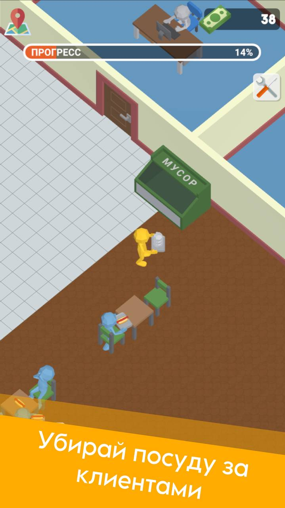
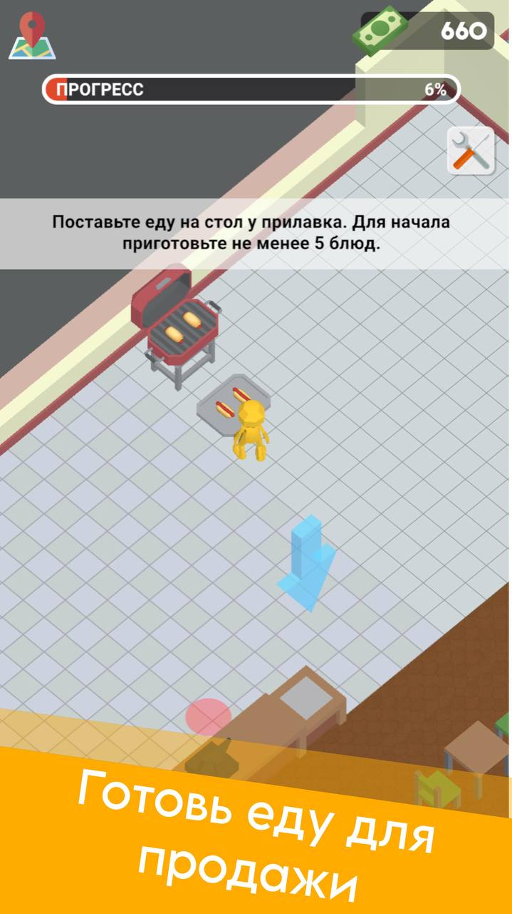
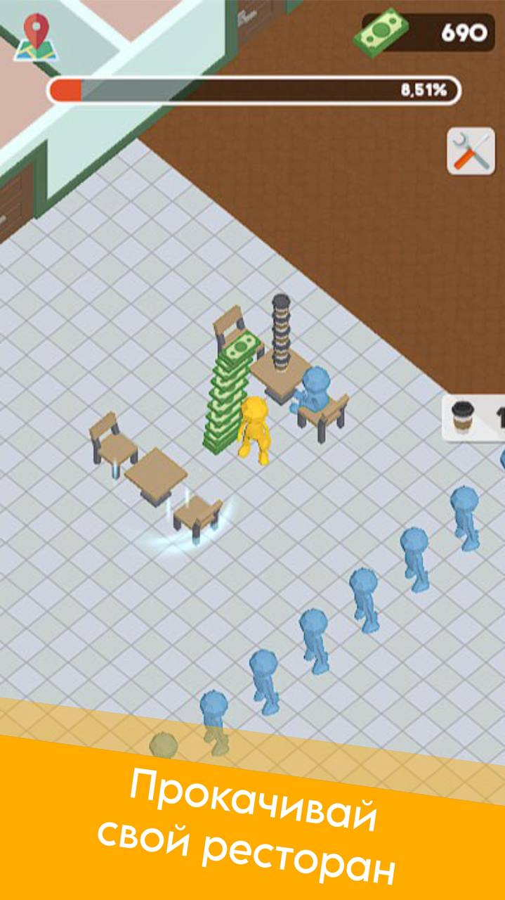
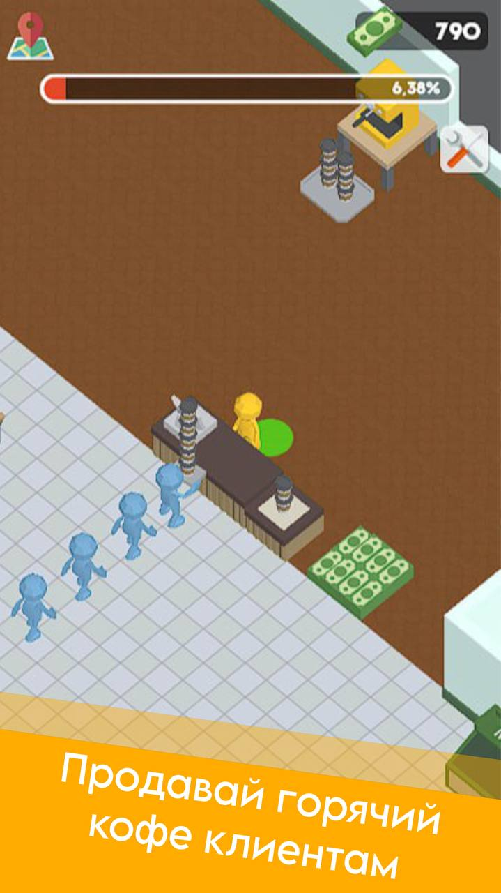

# 🌭 HotDog Hustle – игра про готовку и развитие ресторана

> Забавный симулятор кафе, где ты готовишь хот-доги, кофе и пончики, нанимаешь персонал и прокачиваешь свой ресторан.

---

## 🕹️ Особенности:

- Приготовление хот-догов, кофе, пончиков и других вкусняшек  
- Управление рестораном: улучшения, расширения и дизайн  
- Нанимай персонал для ускорения работы и улучшения сервиса  
- Автоматизация процессов и рост прибыли  
- Увлекательный прогресс с новыми рецептами и оборудованием

---

## 🔧 Платформы

- WebGL (Яндекс.Игры)  
- ПК и мобильные браузеры

---

## 👨‍💻 Разработка

Вся игра сделана мной.

---

## 📸 Скриншоты

  
  
  

---

## 🎥 Видео

[Посмотреть геймплей на YouTube](https://youtube.com/shorts/eSull1goP3A)

---

## 📌 Статус

✅ Базовый функционал готов  
🔄 В разработке новые рецепты и возможности
Сыграть можно по ссылке: https://yandex.ru/games/app/459307

---

## 📫 Контакты
 
- Telegram: [@davidmadridov](https://t.me/davidmadridov)
